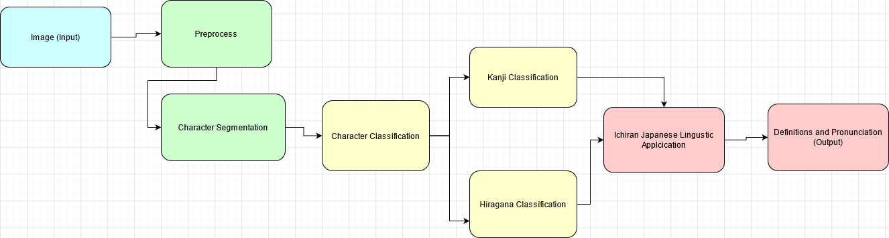
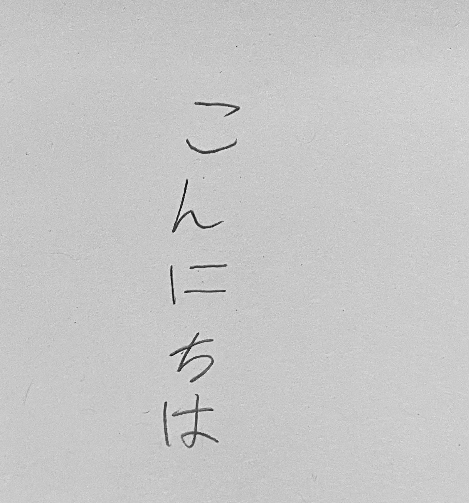
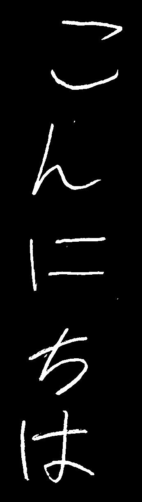
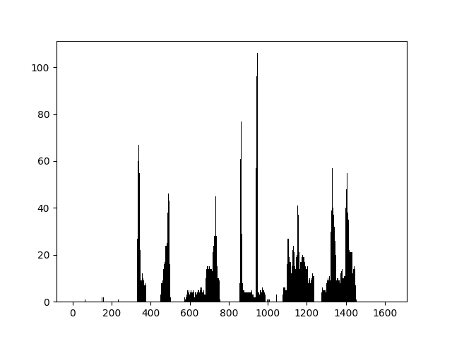
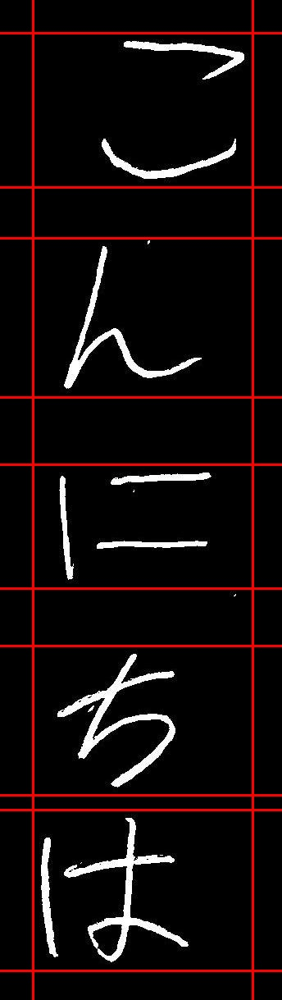

# CSE455-Final-Project
A basic handwritten Japanese Optical Character Recognizer

# Introduction
The problem I was trying to solve was creating a application which can take in an image containing handwritten Japanese which it can then recognize and process. However, I didn't want just a direct translation of the recognized text using some machine translation software, but instead I want to application to take the recongized text and parse words and phrases in the text. This application would be used by people who already have a grasp of Japanese, but are not proficent.

# Data
For data I used data from ETL Character Database. Specifically, I used the dataset ETL8. ETL8 has the 71 basic hiragana and 879 of the most commonly used Kanji.

The Hiragana and Kanji data had 160 writers each writer writing each character one time. Additionally, I used Keras ImageDataGenerator to create more samples with 15 degrees of rotation and 0.2 degress of zoom.

# Approach

This application can be broken up into 4 main parts. Preprocessing, segmentation, prediction, and then parsing. 
For preprocessing, I first take in the image given by the user and first make it grayscale because we don't care about color pixels in this case of character recognition. Next I invert the image because the model is trained using images that are white characters set on a black background. Next, I thresh the images to make all pixels in the image be either completely black or completely white. Finally, I crop the image to get rid of extra space that is not needed. 

The second step is segmentation. The program makes a histogram of all the white pixels in each column and row. This way, for each character there will be a high amount of white pixels and when there is no character or a space then there will be no/few white pixels. By tracking the spaces in these histograms we can create proper bounding boxes for the characters. After creating proper bounding boxes, parse each individual detected image out of the full image and crop any extra space.

# Ichiran Open Source Application
https://github.com/tshatrov/ichiran
# References
http://cs231n.stanford.edu/reports/2016/pdfs/262_Report.pdf 
https://towardsdatascience.com/creating-a-japanese-handwriting-recognizer-70be12732889 
https://github.com/Nippon2019/Handwritten-Japanese-Recognition 
https://towardsdatascience.com/segmentation-in-ocr-10de176cf373 

